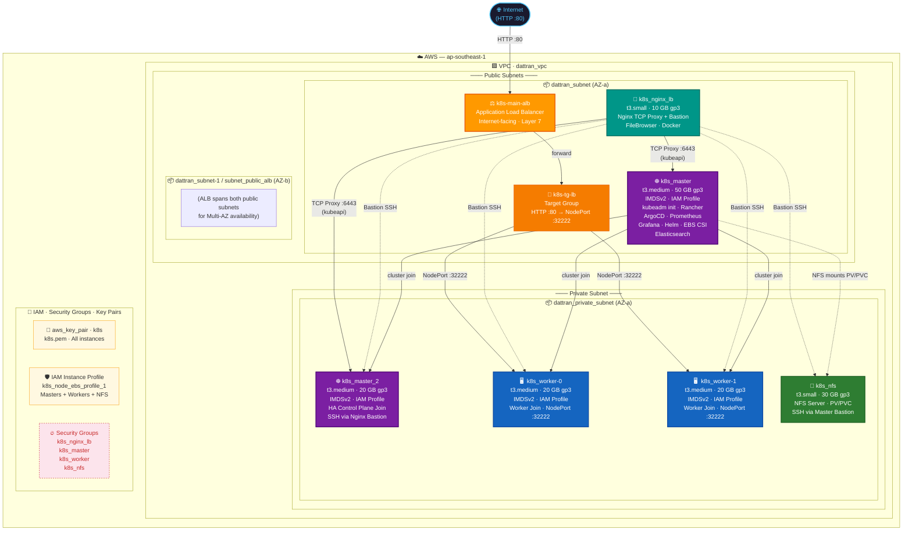

# K8s AWS Infrastructure — Diagram as Code

Paste the blocks below into the supported platforms.

---

## 1. Mermaid (paste into mermaid.live, Notion, GitHub, GitLab, Obsidian)



---

## 2. draw.io XML (paste into app.diagrams.net — File → Import → XML)

Paste the content of `infrastructure-diagram.drawio` (in the same folder) into **Extras → Edit Diagram** on draw.io.

---

## 3. PlantUML (paste into plantuml.com or VS Code PlantUML extension)

```plantuml
@startuml K8s_AWS_Infrastructure
!define AWSPuml https://raw.githubusercontent.com/awslabs/aws-icons-for-plantuml/v18.0/dist
!include AWSPuml/AWSCommon.puml
!include AWSPuml/NetworkingContentDelivery/ElasticLoadBalancing.puml
!include AWSPuml/Compute/EC2.puml
!include AWSPuml/Storage/SimpleStorageService.puml

skinparam rectangle {
    BackgroundColor #FAFAFA
    BorderColor #999
}
skinparam note {
    BackgroundColor #FFF9C4
}

title "K8s AWS Infrastructure — ap-southeast-1"

package "AWS ap-southeast-1" #E8F5E9 {

    package "VPC · dattran_vpc" #F1F8E9 {

        package "Public Subnets" #FFF3E0 {

            rectangle "dattran_subnet (AZ-a)" #FFECB3 {
                [k8s-main-alb\nALB · Internet-facing\nHTTP :80] as ALB #FF9900
                [k8s-tg-lb\nTarget Group\nHTTP→NodePort :32222] as TG #FFA726
                [k8s_nginx_lb\nt3.small · 10GB gp3\nNginx TCP Proxy\nFileBrowser · Bastion] as NGINX #00897B
                [k8s_master\nt3.medium · 50GB gp3\nkubeadm init\nRancher · ArgoCD\nPrometheus · Grafana\nHelm · EBS CSI] as MASTER #7B1FA2
            }

            rectangle "dattran_subnet-1 / subnet_public_alb (AZ-b)" #FFECB3 {
                note "ALB spans both AZs\nfor Multi-AZ HA" as AZ_NOTE
            }
        }

        package "Private Subnet" #E3F2FD {
            rectangle "dattran_private_subnet (AZ-a)" #BBDEFB {
                [k8s_master_2\nt3.medium · 20GB gp3\nHA Control Plane\nSSH via Bastion] as MASTER2 #6A1B9A
                [k8s_worker-0\nt3.medium · 20GB gp3\nWorker Node\nNodePort :32222] as W0 #1565C0
                [k8s_worker-1\nt3.medium · 20GB gp3\nWorker Node\nNodePort :32222] as W1 #1565C0
                [k8s_nfs\nt3.small · 30GB gp3\nNFS Server\nPV / PVC] as NFS #2E7D32
            }
        }
    }

    package "IAM · Security" #FFF8E1 {
        [aws_key_pair · k8s.pem] as KP
        [IAM Profile\nk8s_node_ebs_profile_1] as IAM
        [Security Groups\nnginx_lb · master\nworker · nfs] as SG #FFCDD2
    }
}

actor Internet

Internet -down-> ALB : "HTTP :80"
ALB -down-> TG : forward
TG -down-> W0 : ":32222"
TG -down-> W1 : ":32222"
NGINX -right-> MASTER : "TCP :6443"
NGINX -down-> MASTER2 : "TCP :6443 / Bastion"
NGINX ..> W0 : Bastion SSH
NGINX ..> W1 : Bastion SSH
NGINX ..> NFS : Bastion SSH
MASTER -down-> MASTER2 : kubeadm join
MASTER -down-> W0 : kubeadm join
MASTER -down-> W1 : kubeadm join
MASTER ..> NFS : NFS mount

@enduml
```
